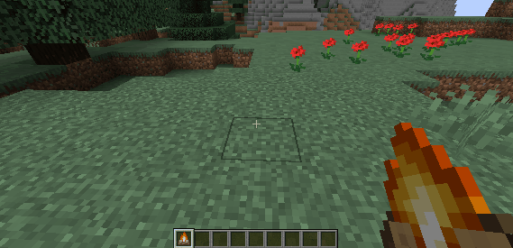

# Unlit Campfire

[.svg)](https://www.curseforge.com/minecraft/mc-mods/unlit-campfire)
[.svg)](https://www.curseforge.com/minecraft/mc-mods/unlit-campfire/files)

Placing a lit campfire is a hot task. Do something good for your hands and install this mod, because then you won't burn your hands when you place a campfire.

This is a **Minecraft Forge** mod and sets the **default state of a campfire to unlit**.

This mod is configurable. All config options can be found in the wiki: https://github.com/cech12/UnlitCampfire/wiki
