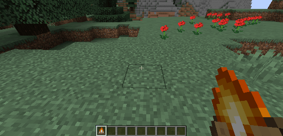

# Unlit Campfire

[.svg)](https://www.curseforge.com/minecraft/mc-mods/unlit-campfire)
[.svg)](https://www.curseforge.com/minecraft/mc-mods/unlit-campfire/files)

Placing a lit campfire is a hot task. Do something good for your hands and install this mod, because then you won't burn your hands when you place a campfire.

This is a Minecraft mod (Forge, NeoForge, Fabric, Quilt) and sets the **default state of a campfire to unlit**.

This mod is configurable. All config options can be found in the wiki: https://github.com/cech12/UnlitCampfire/wiki

## Dependencies

The Fabric / Quilt version needs the following mods:

- Fabric API ([Github](https://github.com/FabricMC/fabric), [Curseforge](https://www.curseforge.com/minecraft/mc-mods/fabric-api), [Modrinth](https://modrinth.com/mod/fabric-api))
- Cloth Config API ([Github](https://github.com/shedaniel/cloth-config), [Curseforge](https://www.curseforge.com/minecraft/mc-mods/cloth-config), [Modrinth](https://modrinth.com/mod/cloth-config))

## Compatibility

### Lithium (Fabric)

Since 1.20.4-2.3.0.1 and 1.20.6-2.5.0.1 this mod is compatible with Lithium. For earlier versions please see the wiki: https://github.com/cech12/UnlitCampfire/wiki
